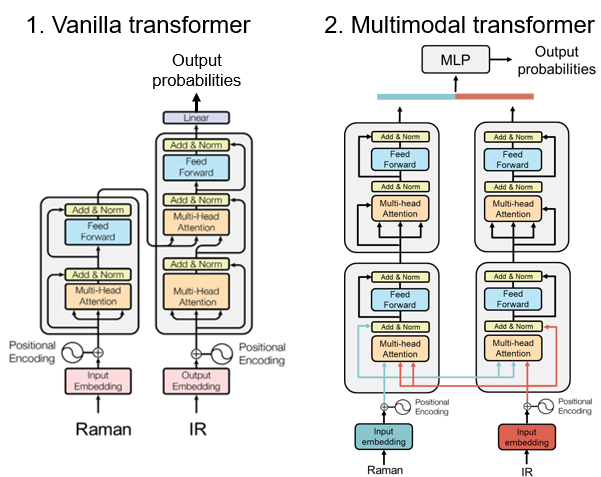

# MultiSpec
Functional group identification using vibrational spectroscopy and other spectroscopic methods.

## Dataset
- Simulated: QM9S Raman and IR.
- Experimental: KnowItAll.

## Model:
- Transformer, with cross-attention first and self-attention next.

